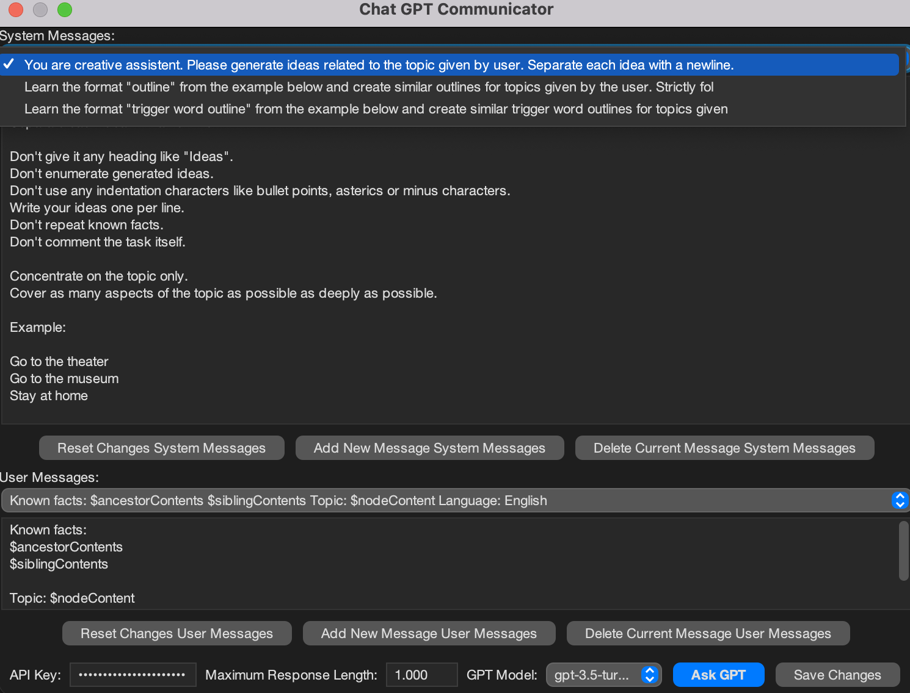
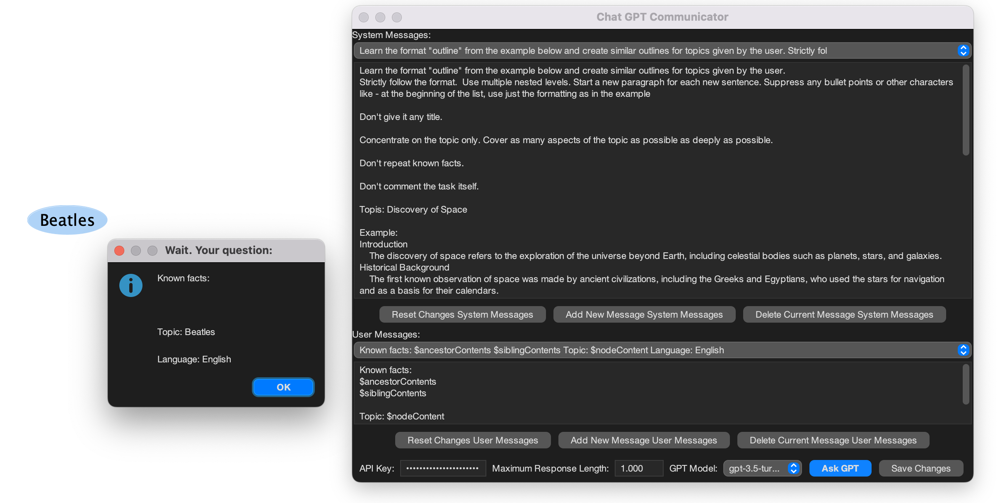
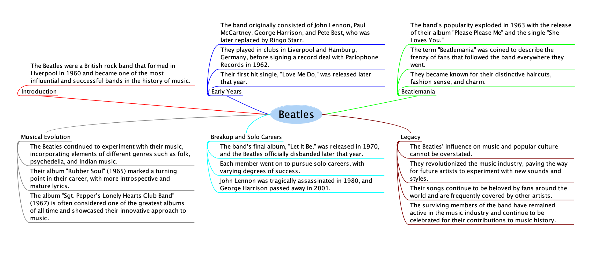

# An add-on for freeplane that uses LLM APIs to brainstorm ideas from any selected node

## Features
- **Quick Prompt (Ctrl+Alt+G):** Generate ideas or expand nodes using a pre-configured prompt with a single shortcut.
- **Compare Connected Nodes (v0.4.0):** Analyze linked nodes using custom comparison types (e.g., Pros/Cons, Strengths/Weaknesses) and add structured results as child nodes.
- **Customizable Prompts:** Configure system and user message templates to tailor LLM interactions.
- **Multiple LLM Providers:** Supports OpenAI and OpenRouter APIs.
- **Branch Generation:** Automatically appends LLM responses as mind map branches.

Communicator window

Communicator window

-----------

Prompt sent

-----------
Response returned

## Compare Connected Nodes (v0.4.0+)
Analyze relationships between two connected nodes using structured comparisons:

1. **Create Connection** - Add a connector between two nodes
2. **Select Both Nodes** - Select the two connected nodes
3. **Invoke Comparison**:
   - Menu: `Tools > LLM AddOn > Compare Connected Nodes`
   - Shortcut: None (configurable via preferences)
4. **Choose Comparison Type**:
   - Select from common types (Pros/Cons, Strengths/Weaknesses etc.) from the dropdown.
   - Or enter a custom comparison type (e.g., "Cost vs Benefits") directly into the box.

The add-on will:
- Query the LLM to analyze both nodes based on your comparison type using a dedicated prompt.
- Add structured results as child nodes under each of the selected nodes.
- Save any newly entered custom comparison types for quick reuse in the dropdown next time.

### Setup
Install add-on using the LLM-AddOn-v0.3.7.addon.mm file. Other files are used for development only.

# Pre-requisites

Check-list before starting
- [ ] I have an **OpenRouter or Open AI account**
- [ ] **Freeplane app is installed** on my computer
- [ ] **LLM add-on is installed** in Freeplane.

# Step by step configuration of Freeplane Open AI add-on

## In your Open Router Account

1. **Go to** web page https://openrouter.ai/settings/keys
2. **Log in** using MetaMask or other method
3. **Add credit** to your account using crypto currency or other method
4. **Create Key** by clicking on "Create Key" button like shown bellow and finally **copy this newly generated key**.

## Alternatively, in your Open AI Account

1. **Go to** web page https://platform.openai.com/account/api-keys
2. **Log in** using your ChatGPT account
3. **Create a new Key** by clicking on "Create a new secret Key" button like shown bellow and finally **copy this newly generated key**.

## In Freeplane, first use

1. Click on the **LLM** top menu, click **Configure Prompts and Model**
2. Select your API provider
3. **Paste an API key** into the field "API key".
4. Click **Save Changes**

... you're done.

## Recent Features
### v0.4.0
- Added "Compare Connected Nodes" feature for analyzing node relationships using a dedicated prompt and custom comparison types.
### v0.3.6
- **Quick Prompt Shortcut**: Use `Ctrl+Alt+G` to instantly generate content using your saved settings
- **Direct API Access**: Choose between OpenAI and OpenRouter providers

To modify saved settings:
1. Go to **LLM > Configure Prompts & Model**
2. Adjust settings and click "Save Changes"

## Prompt template
The default prompt should be found in the add-on configuration. 
It is a good starting point for brainstorming ideas. You can change it to suit your needs. 

The following variables are replaced by the add-on:
- `$nodeContent` is replaced with the text of the selected node
- `$siblingContents` is replaced with the sibling branches of the selected node
- `$ancestorContents` is replaced with the child branches of the selected node

- `$rootText` can also be used to ground the model in the root context of the map

Using that default template LLM will be asked to generate ideas related to the selected node.

The `node` variable is rendered by a groovy template and comes from the groovy script DSL within freeplane. There are probably many more useful variables that can be used, but I haven't found them yet.  

## Improvements
Prompt and feature suggestions are very welcome, this is only a start!

### Work in progress / future release
- [x] Add preferences to set GPT parameters
- [x] Add comparative analysis between connected nodes (v0.4.0)

For other feature ideas check the [project roadmap](docs/ROADMAP.md)

